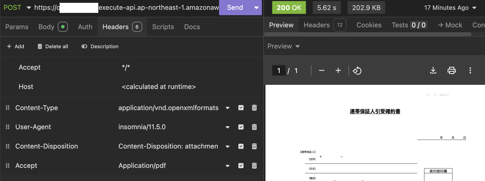

# Convert Microsoft Office Documents To PDF
## With LibreOffice + Docker + Express/Lambda

This repository contains the **full** set up for hosting an API endpoint that converts any Microsoft office documents to PDF using API Gateway and Lambda.

Also, since the lambda proxy function is written with Express and [Lambda Web adaptor](https://github.com/awslabs/aws-lambda-web-adapter) instead of using a specific serverless framework such as [@codegenie/serverless-express](https://github.com/CodeGenieApp/serverless-express), the docker image can be easily resued for deploying on other platforms such as as an ECS farget.

For more details, please refer to my Blog [LibreOffice+Docker+Express/Lambda: Convert Office To PDF. Serverless. For Free!](https://medium.com/@itsuki.enjoy/libreoffice-docker-express-lambda-convert-office-to-pdf-serverless-for-free-8781bc2f0c55)

## Basic Idea

### LibreOffice
[LibreOffice](https://www.libreoffice.org/) is a private, free and open source office suite compatible with Microsoft Office/365 files such as .doc, .docx, .xls, .xlsx, .ppt, .pptx.

We can manipulate(edit, export, and etc.) office documents using the GUI provided but it also comes with a command line functionality for converting any office document (Word, Excel, PowerPoint, and etc.) into PDF.
On Linux, it is (or can be) as simple as following.

```
/usr/bin/libreoffice --headless --convert-to pdf source-file.excel
```

This will automatically choose a filter for conversion, for example, calc_pdf_Export for Excel, and output the converted PDF file with the following print out to stdout.

```
convert /tmp/Print_180_45_4.xlsx as a Calc document -> /app/Print_180_45_4.pdf using filter: calc_pdf_Export
```


### General Approach

Within our function code, we
1. Receive the file bytes
2. Temporarily save it with `fs`
3. Convert it to PDF with the command above using `child_process`
4. Read the PDF converted and return the bytes

For Docker image, we have A Ubuntu/Debian Image with libreoffice installed so that we can ran the commands above.


## Testing And Deployment

### Local Test
To build the image and run the container,

```
cd lambda
docker build . -t office-to-pdf-converter
docker run -p 8080:8080 office-to-pdf-converter
```

We can then `POST` our office document directly as body bytes to `localhost:8080` to test it out.

**NOTE**:
1. `Content-Disposition` header with the following format `Content-Disposition: attachment; filename*=UTF-8''demo.xlsx` is required so that we can get the file name within our express handlers.


### Deployment
Sign in the AWS Acoount from the command line, and ran

```
cdk deploy
```

This will create the lambda function from the Dockerfile, and an API Gateway with the lambda function as the proxy intergration.


### Invoke API Endpoint

After deployment, we can then invoke the API gateway endpoint.

In addition to the `Content-Disposition` header, we will also have to set the `Accept` header to `application/pdf`, case insensitive, but wild cards will not work.

This is required for API Gateway to send binary data back as it is instead of trying to `base64` encode it.

